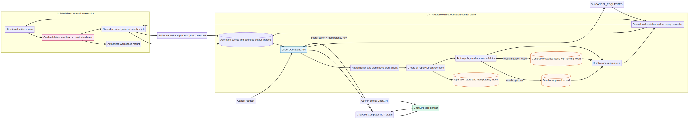
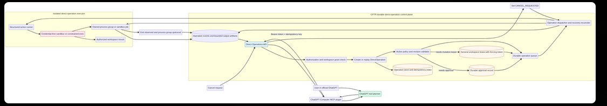

# Durable Direct Operations Architecture

**Status:** Proposed replacement design for the current direct-coding PRs
**Audience:** CPTR and ChatGPT MCP maintainers
**Decision:** Replace the current raw-shell direct-coding endpoint with a durable, policy-enforced operation subsystem. The official ChatGPT model remains the planner and tool caller; CPTR’s agent loop is not involved.





> The supplied review map is retained as an input artifact for architectural discussion. The normative design is the lifecycle, data model, API, and security contract specified in this document.

## 1. Decision summary

The current direct-coding proposal correctly separates **ChatGPT reasoning** from **CPTR workspace access**, but it treats a file write or command as an ordinary synchronous HTTP action. That is insufficient once those actions can mutate a workspace, create processes, need cancellation, or survive an application restart.

This design introduces **Direct Operations**: durable, auditable units of work owned by an authenticated user and a single authorized workspace. Direct Operations are neither CPTR tasks nor autonomous monitors. They are a separate control-plane resource with equivalent production guarantees for identity, idempotency, workspace coordination, operation-specific approval, cancellation, recovery, and evidence.

> **Core principle:** ChatGPT chooses *what* operation to request. CPTR decides *whether*, *when*, and *where* that operation may run, and records its full lifecycle durably.

The design deliberately removes public free-form shell execution. Command-style validation becomes a named, structured developer action executed without a host shell and, for untrusted workspaces, inside a credential-free sandbox.

## 2. Goals and non-goals

| Goals | Non-goals |
|---|---|
| Preserve an autonomous, tool-driven ChatGPT coding loop without invoking `AgentService` or the CPTR autonomous supervisor. | Recreate CPTR’s internal agent-task lifecycle under a different name. |
| Make mutations and execution replay-safe, cancellable, auditable, recoverable, and conflict-aware. | Expose arbitrary host-shell access to an MCP caller. |
| Support least-privilege workspace reads, versioned writes/edits, and approved validation actions. | Treat a credential scope or request boolean as per-operation user approval. |
| Coordinate direct operations with existing autonomous monitors through one generalized workspace lease. | Allow a direct operation to bypass workspace coordination because it was initiated through ChatGPT. |
| Bound every model-visible result, error, directory listing, search result, and output stream. | Promise transparent recovery of a process that cannot be observed after a crash. |

## 3. Trust and component boundaries

The official ChatGPT app calls the MCP plugin. The plugin is a **transport adapter**, not an authorization authority. CPTR validates the bearer token, workspace grant, operation policy, lease, idempotency record, approval, and executor result for every state-changing request.

| Component | Responsibility | Must not do |
|---|---|---|
| Official ChatGPT | Plans the coding loop and selects MCP tools. | Gain a host shell, bypass a rejected policy, or infer hidden error details. |
| MCP plugin | Validates tool schemas, forwards the dedicated connector token, and renders bounded structured results. | Decide authorization, fabricate approval, or store durable lifecycle truth. |
| Direct Operations API | Creates/replays operations, authorizes, validates revisions, submits approval requests, and exposes durable state. | Run raw shell text inline. |
| Operation store | Persists state, events, idempotency, approvals, leases, artifacts, and recovery metadata. | Store secrets or unbounded output in hot rows. |
| Dispatcher/reconciler | Claims work, grants/revokes leases, starts isolated execution, reconciles interrupted work, and performs cancellation. | Mark an operation terminal before process/sandbox quiescence is observed. |
| Structured executor | Applies versioned file mutations or runs named actions with `argv`, resource limits, and a sandbox policy. | Invoke `create_subprocess_shell`, inherit host credentials, or use arbitrary paths. |
| Existing CPTR agent loop | Continues to own `cptr_start_task` and autonomous monitoring. | Own direct operations or be silently invoked by them. |

## 4. Lifecycle model

### 4.1 What is durable

A **side-effecting direct operation** is durable: file create/replace, versioned edit, named validation action, cancellation, approval, and any future workspace mutation. It receives a `direct_operation_id` before execution begins.

Pure inspection may stay synchronous because it has no process or mutation lifecycle. It is still policy controlled, output bounded, and audit logged. A bounded read/search/list does not need a queue record merely to return text. If operational audit retention requires it, it can emit an immutable audit event rather than a full lifecycle object.

### 4.2 State machine

```text
REQUESTED
  ├─ idempotent replay → return original operation
  ├─ policy rejected → REJECTED (terminal)
  ├─ approval required → WAITING_APPROVAL
  └─ lease/action valid → QUEUED

WAITING_APPROVAL
  ├─ approved → QUEUED
  ├─ denied or expired → REJECTED (terminal)
  └─ cancel → CANCELLED (terminal)

QUEUED → DISPATCHING → RUNNING
RUNNING → SUCCEEDED | FAILED | CANCEL_REQUESTED
CANCEL_REQUESTED → CANCELLED only after owned process/sandbox quiesces

On service restart:
RUNNING or CANCEL_REQUESTED → RECOVERING → RUNNING | SUCCEEDED | FAILED | CANCELLED | ORPHANED
```

`ORPHANED` is not a successful result. It means the prior executor cannot be verified as alive or conclusively terminated after reconciliation. The system must record the condition, stop automatic retries, surface it to the user, and require an administrator/operator recovery decision where necessary.

| State | Meaning | Legal terminal transition |
|---|---|---|
| `REQUESTED` | Request was accepted but has not passed creation checks. | `REJECTED`, `WAITING_APPROVAL`, `QUEUED` |
| `WAITING_APPROVAL` | A durable operation-specific approval is required. | `QUEUED`, `REJECTED`, `CANCELLED` |
| `QUEUED` | Authorized and waiting for a dispatcher claim/lease. | `DISPATCHING`, `CANCELLED`, `FAILED` |
| `DISPATCHING` | Executor reservation and lease are being established. | `RUNNING`, `FAILED`, `CANCELLED` |
| `RUNNING` | The mutation or executor is active. | `SUCCEEDED`, `FAILED`, `CANCEL_REQUESTED` |
| `CANCEL_REQUESTED` | Cancellation intent is durable; the executor must quiesce. | `CANCELLED`, `FAILED`, `ORPHANED` |
| `RECOVERING` | A restart reconciler is determining execution truth. | `RUNNING`, `SUCCEEDED`, `FAILED`, `CANCELLED`, `ORPHANED` |
| `SUCCEEDED` | Durable result and artifacts were finalized. | Terminal |
| `FAILED` | Execution failed with a normalized public error and internal diagnostic. | Terminal |
| `CANCELLED` | Cancellation completed and the owned process/sandbox was observed quiescent. | Terminal |
| `REJECTED` | Policy, revision, approval, or authorization denied execution. | Terminal |
| `ORPHANED` | Recovery could not prove executor state; no automatic success is inferred. | Terminal pending explicit recovery workflow |

## 5. Persistent data model

The design extends the existing SQL control-plane store rather than using in-memory `command_sessions` as the source of truth.

### 5.1 `direct_operations`

| Column | Purpose |
|---|---|
| `id` | Immutable `direct_operation_id` returned to the connector. |
| `user_id`, `workspace_id` | Ownership and authorization subject. |
| `kind` | `WRITE_FILE`, `EDIT_FILE`, `RUN_ACTION`, `CANCEL`, or a future supported kind. |
| `state` | Lifecycle state from the state machine. |
| `request_digest` | Hash of canonical operation parameters; prevents idempotency-key reuse with different input. |
| `idempotency_key` | Caller retry key, unique within `(user_id, workspace_id, kind, idempotency_key)`. |
| `expected_revision` | Revision/ETag asserted for a mutation, where applicable. |
| `lease_fencing_token` | Monotonic token assigned when mutation lease is acquired. |
| `approval_id` | Optional reference to the operation-specific approval record. |
| `executor_type`, `executor_ref` | Structured executor/sandbox type and external job or process-group identity. |
| `public_result` | Small normalized terminal result only; never unbounded output. |
| `public_error_code` | Stable, client-safe error code. |
| `created_at`, `started_at`, `finished_at`, `cancel_requested_at` | Audit and timeout/recovery fields. |
| `version` | Optimistic row version for state transitions. |

**Constraints and indexes** must include a composite idempotency uniqueness key, workspace-state queue index, executor reference index, and user/workspace authorization index. `idempotency_key` reuse with a different canonical request digest returns `409 IDEMPOTENCY_KEY_CONFLICT`.

### 5.2 Supporting tables

| Table | Purpose |
|---|---|
| `direct_operation_events` | Append-only state transitions, policy decisions, normalized diagnostics, and actor metadata. |
| `direct_operation_artifacts` | Chunked, bounded stdout/stderr, result snippets, and redacted executor metadata. Artifacts are page-addressable by cursor. |
| `direct_operation_approvals` | Immutable approval prompt digest, approver, expiry, decision, and decision timestamp. |
| `workspace_operation_leases` | General lease shared by direct operations and autonomous monitors. Contains workspace ID, holder type/ID, fencing token, expiry, and renewal timestamp. |
| `workspace_file_revisions` | Optional maintained content hash/version for efficient compare-and-swap. A read may calculate an ETag from a stable file hash if a separate table is unnecessary. |

### 5.3 Generalized workspace lease

The present monitor-only lease concept should be generalized. A lease is held by either `DIRECT_OPERATION` or `AUTONOMOUS_MONITOR`, never by a vague request.

A mutation acquires the lease through an atomic compare-and-set transaction. The holder receives a monotonically increasing fencing token. Any executor write must carry that token; a stale holder cannot commit after its lease expires or is superseded. This removes the direct-write versus monitor-write race without making every operation a task.

Read-only inspections can remain concurrent. A named action declares whether it is `READ_ONLY` or `MAY_MUTATE`; the latter requires the workspace mutation lease.

## 6. API and MCP contract

The unsafe `/api/control/v1/workspaces/{id}/coding/commands` endpoint should not become a permanent public contract. Because the parent PR is not merged, introduce a clean **v2 direct-operations API** rather than preserve the unsafe shape.

### 6.1 Control API

| Endpoint | Purpose |
|---|---|
| `POST /api/control/v2/workspaces/{workspace_id}/operations` | Create or idempotently replay a side-effecting direct operation. |
| `GET /api/control/v2/operations/{operation_id}` | Retrieve durable state and bounded summary. |
| `GET /api/control/v2/operations/{operation_id}/events?cursor=` | Retrieve bounded lifecycle events/artifacts. |
| `POST /api/control/v2/operations/{operation_id}/cancel` | Record cancellation intent idempotently; return `CANCEL_REQUESTED` or terminal state. |
| `POST /api/control/v2/operations/{operation_id}/approval` | Record authorized decision for a specific pending approval. |
| `POST /api/control/v2/workspaces/{workspace_id}/inspect/*` | Synchronous bounded list/read/search endpoints with cursor/page controls. |

Every state-changing request must include an idempotency key. The API should accept it in a dedicated `Idempotency-Key` header and mirror it in the JSON schema for MCP portability. The server computes the canonical request digest; it never trusts the client’s claim that two requests are equivalent.

### 6.2 Mutation request examples

```json
{
  "kind": "EDIT_FILE",
  "idempotency_key": "chatgpt-turn-42-edit-config-v1",
  "path": "src/config.ts",
  "expected_revision": "sha256:...",
  "target": "const timeout = 30;",
  "replacement": "const timeout = 60;"
}
```

```json
{
  "kind": "RUN_ACTION",
  "idempotency_key": "chatgpt-turn-42-typecheck-v1",
  "action": "typecheck",
  "expected_workspace_revision": "git:tree:..."
}
```

The response returns `operation_id`, initial `state`, lease/approval status, and a stable poll URL. A retry with the same key and digest returns the original operation. A retry with the same key and different input fails safely.

### 6.3 ChatGPT-facing MCP tools

The MCP surface should prefer stable operations over low-level host primitives.

| Tool | Contract |
|---|---|
| `cptr_inspect_list`, `cptr_inspect_read`, `cptr_inspect_search` | Bounded, paginated synchronous inspection. Reads return revision/ETag. |
| `cptr_create_file_operation` | Creates a versioned file-write operation with idempotency key. |
| `cptr_create_edit_operation` | Creates a compare-and-swap exact-edit operation with idempotency key. |
| `cptr_run_workspace_action` | Starts a named structured action; no raw command field. |
| `cptr_get_operation` | Returns state, summary, and bounded result. |
| `cptr_get_operation_events` | Retrieves cursor-paginated output/events. |
| `cptr_cancel_operation` | Requests durable cancellation using an idempotency key. |
| `cptr_approve_operation` | Supplies a user-authorized decision for one specific approval ID. |

The plugin should retain `cptr_start_task` only as a clearly separate CPTR-agent workflow. It should not advertise `cptr_execute_task` as the preferred route for direct coding. Task annotations must be revisited to accurately communicate potential workspace mutation.

## 7. Idempotency and retry semantics

Idempotency is an operation property, not a best-effort plugin retry behavior.

1. The caller supplies an opaque idempotency key for every side-effecting operation.
2. The MCP plugin preserves that key for transport-level retries it initiates.
3. The Control API canonicalizes the request and stores a request digest atomically with the new operation.
4. A matching replay returns the same operation and current state without enqueueing another executor.
5. A mismatched replay returns a conflict. One key cannot be reused across workspaces, operation kinds, or differing input.
6. A cancellation is its own idempotent operation against one target operation ID; repeated requests return the existing cancellation state.

The user-facing tool description must instruct ChatGPT to reuse the original key only for a retry of the same logical action. A new intended edit or command requires a new key.

## 8. Versioned file mutation

The existing unique-target rule is useful but insufficient. A stale read can still overwrite a concurrent writer. The new contract must make a mutation conditional on a revision observed during inspection.

1. `cptr_inspect_read` returns `revision` based on a content hash and metadata stable for the workspace path.
2. The create-edit/write request includes `expected_revision`.
3. The dispatcher obtains the workspace mutation lease, rereads the file, and checks the revision immediately before write.
4. If the revision differs, the operation reaches `REJECTED` with `REVISION_CONFLICT`; ChatGPT reads the new file and reasons again.
5. The write commits atomically using a temporary file plus rename within the workspace mount, while retaining the lease fencing token.

This yields the desired ChatGPT loop: **read → reason → propose mutation → conflict or success → inspect again**, rather than blind last-writer-wins behavior.

## 9. Safe developer action execution

### 9.1 Remove public raw shell text

The public API must not accept `command: string`. Replacing a denylist with a larger denylist is not a security control. An arbitrary shell can invoke Python, Node, Bash, redirection, encoded payloads, substitutions, and networking in many equivalent forms.

### 9.2 Named action profiles

Use named actions defined by trusted CPTR policy, for example:

| Action | Example allowed implementation | Mutation class | Network default |
|---|---|---|---|
| `test` | `argv: ["npm", "test", "--", "--runInBand"]` | `MAY_MUTATE` if caches are written | Disabled |
| `typecheck` | `argv: ["npm", "run", "typecheck"]` | `READ_ONLY` or `MAY_MUTATE` by profile | Disabled |
| `lint` | `argv: ["ruff", "check", "."]` | `READ_ONLY` | Disabled |
| `build` | Trusted project-specific build profile | `MAY_MUTATE` | Disabled |

The executor receives an `argv` array and calls an exec API directly. It never invokes a shell. Action definitions, working directories, allowed environment variables, resource caps, timeouts, and mutation classification are validated server-side.

Because a workspace can contain malicious project configuration, host safety cannot rely solely on an `argv` allowlist. The safe target is a **credential-free disposable sandbox** with only the authorized workspace mounted, non-root identity, read-only root filesystem, explicit writable scratch/workspace mounts, cgroup resource limits, process count cap, timeout, and disabled network by default.

### 9.3 External effects and approval

A credential scope may authorize a connector to **request** an external operation; it is not approval to perform a particular operation. If an action profile permits external connectivity, the API creates `WAITING_APPROVAL` with a normalized action summary and immutable request digest. Only a user-approved decision tied to that exact operation can queue execution.

Network approval should be an exception. The standard direct-coding path should use offline caches or pre-provisioned dependencies, and named actions should default to no network.

## 10. Cancellation and recovery

Cancellation is a durable state transition, not an immediate claim that a process has stopped.

1. `cancel` atomically records `CANCEL_REQUESTED` and an event with requester identity and reason.
2. The dispatcher instructs the sandbox/job manager to terminate the owned process group or job.
3. The dispatcher waits for an exit observation and confirms that descendants are quiescent.
4. Only then does it write `CANCELLED`, the exit signal, final cursor, and bounded terminal artifact.
5. If the dispatcher crashes, startup reconciliation scans `RUNNING`, `CANCEL_REQUESTED`, and `RECOVERING` operations. It queries the sandbox/job manager by `executor_ref`; it does not assume success from a missing in-memory session.
6. When executor state cannot be proven, the operation becomes `ORPHANED` and is surfaced for explicit recovery.

This model avoids the current ambiguity where a cancelled command can be returned as `COMPLETE` simply because the old in-memory session is done.

## 11. Authorization and key model

Direct operations should not be added to broad default CPTR API keys. Create dedicated connector credentials with explicit opt-in scopes such as:

| Scope | Capability |
|---|---|
| `direct:inspect` | Bounded list/read/search in granted workspaces. |
| `direct:mutate` | Create versioned file write/edit operations. |
| `direct:execute` | Request named local action profiles. |
| `direct:request_external` | Create an approval request for an external-capable action; cannot bypass approval. |
| `direct:approve` | Record an authorized decision on a pending approval where product policy permits it. |

The Control API verifies both workspace ownership/grant and required scope. The MCP plugin should be provisioned with a dedicated least-privilege connector key, not a general control-plane key.

## 12. Bounded responses and error hygiene

All model-visible data needs hard limits.

| Surface | Required rule |
|---|---|
| Directory list | Maximum depth, entry count, and bytes; cursor plus `truncated` metadata. |
| Search | Maximum matches, line width, bytes, and page cursor. |
| Read | Existing size cap retained; add output cap and revision. |
| Operation events | Cursor pagination and bounded chunk size. |
| Executor output | Store stream chunks separately; return bounded excerpts and a next cursor. |
| Errors | Return stable public codes such as `POLICY_REJECTED`, `REVISION_CONFLICT`, `WORKSPACE_BUSY`, and `APPROVAL_REQUIRED`. Keep host paths, stack traces, raw shell/sandbox internals, and secrets in protected logs only. |

## 13. Implementation sequence

| Phase | Deliverable | Exit criterion |
|---|---|---|
| 0. Containment | Mark current parent PRs draft; remove or disable the raw-command tool from the parent-facing branch. | No arbitrary shell reaches the host through MCP. |
| 1. Foundation | SQL models, state machine, event store, idempotency store, generalized leases, migration, and operation service. | Unit tests cover transitions, replay, and lease fencing. |
| 2. Safe mutations | Versioned write/edit operations, inspection revisions, normalized errors, pagination, and dedicated connector scopes. | Race, stale-write, and authorization tests pass. |
| 3. Action executor | Named action registry plus non-shell executor and disposable sandbox/job backend. | Adversarial input cannot escape the action profile/sandbox. |
| 4. Approval/cancellation/recovery | Durable approval records, cancellation/quiescence, reconciliation, orphan handling, and audit events. | Restart and cancellation race tests pass. |
| 5. MCP adaptation | Replace raw command schema with action/operation contracts; enforce idempotency fields; revise annotations. | Contract tests cover all tool state transitions. |
| 6. End-to-end hardening | Disposable plugin-to-CPTR integration environment, CI checks, security review, and live ChatGPT smoke test. | Parent PR checks are green and a follow-up review approves merge. |

## 14. Required test matrix

| Category | Required tests |
|---|---|
| Policy | Reject shell metacharacters, interpreters, nested shell requests, arbitrary commands, unregistered action profiles, absolute workspace paths, and external action without durable approval. |
| Idempotency | Duplicate create/edit/action/cancel request with the same key returns one operation; mismatched replay is rejected. |
| Concurrency | Direct write versus direct write; direct edit versus autonomous monitor; lease expiry/fencing token; stale revision rejection. |
| Cancellation | Completion/cancel race; process-tree cancellation; duplicate cancel; cancellation during approval; timeout while cancellation is pending. |
| Recovery | Service restart at each nonterminal state; lost executor reference; executor already exited; orphan handling. |
| Output/error | Huge workspace listing, huge search result, huge output stream, binary/error path leakage, token/environment redaction. |
| Authorization | Default key cannot access direct operations; dedicated key has only granted capabilities; one workspace’s key cannot access another workspace. |
| Cross-system integration | MCP tool call → plugin → authenticated API → durable operation → lease → executor → events → cancellation/replay/recovery. |

## 15. Compatibility and migration

The parent PRs should not be patched into a superficially safer version of the current `/coding/commands` API. They should be superseded by the v2 operation contract. Existing CPTR task and autonomous-monitor APIs remain unchanged and continue to use their own durable stores.

The plugin should support a clear capability negotiation or versioned base path. Until v2 is deployed, it must not expose direct mutation/execution tools against the old endpoint. Inspection-only tools may be introduced earlier only if their response bounds and error hygiene meet this design.

## 16. Acceptance criteria

The durable direct-operation design is ready to implement when the team accepts the following non-negotiable conditions:

1. No MCP endpoint accepts arbitrary shell text for host execution.
2. Every side-effecting direct operation has a durable ID, owner, idempotency record, lifecycle state, and audit trail.
3. Every workspace mutation is lease-protected and revision-conditional.
4. Cancellation is durable and reaches `CANCELLED` only after owned execution is observed quiescent.
5. Recovery never infers success merely because in-memory state disappeared.
6. External effects require an operation-specific durable approval, not a Boolean supplied by the caller.
7. All model-visible output and errors are bounded and sanitized.
8. Direct capabilities are opt-in through a dedicated least-privilege key.
9. The end-to-end integration suite validates the real MCP-to-CPTR operation path before a parent PR is merged.

## References

[1]: https://github.com/heidi-dang/computer/pull/3 "Current computer direct-coding PR"
[2]: https://github.com/heidi-dang/chatgpt-computer-plugin/pull/2 "Current plugin direct-coding PR"
[3]: The user-supplied independent PR review, retained as the embedded review-map artifact in this document.
